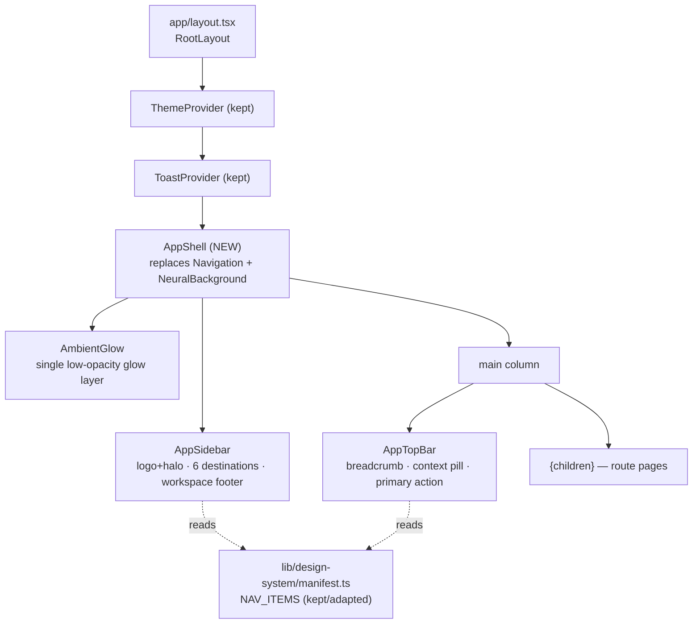
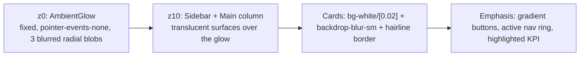
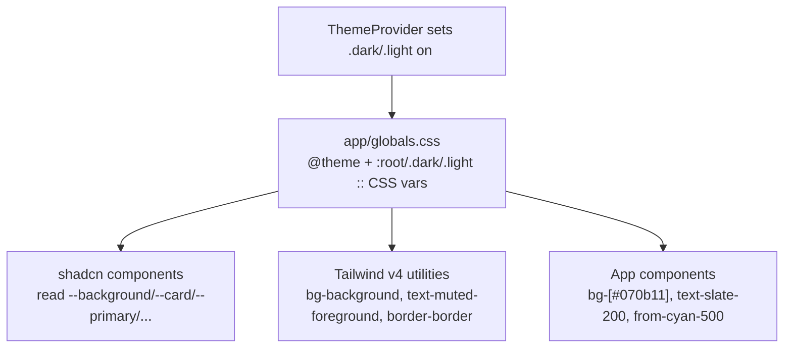
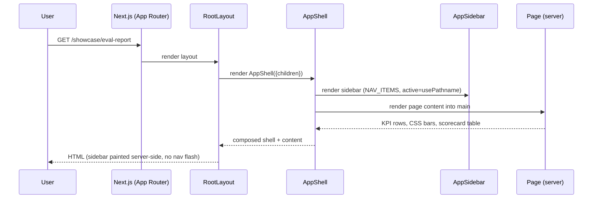
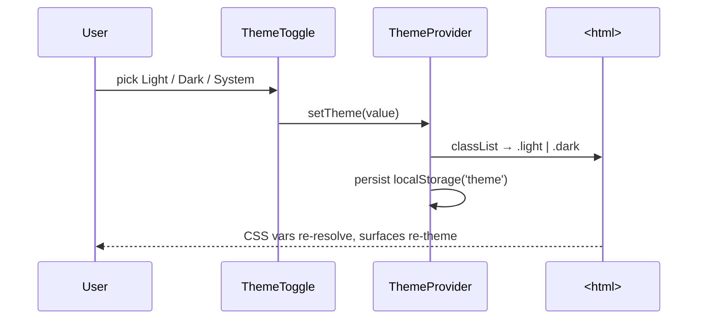

# Design Document: App Redesign

## Overview

This redesign rolls a single, **proven** design language across the whole AI Debate
Arena app shell and its real research screens. The language is not invented here — it
is the one the product owner explicitly approved by reviewing a live reference screen
(`app/reference/page.tsx`, captured in `design-reference-final.png` and
`design-reference-fullpage.png`). That screen — a "Benchmark run scorecard" eval report —
is the **canonical visual ground truth**. This document describes the system that
generalizes it and the plan to apply it everywhere.

The previous attempt failed for a specific, diagnosable reason: its spec optimized for
*measurable* compliance (token counts, contrast ratios, axe passes) but never encoded an
actual design direction or taste, so it shipped a result that passed tests and still
looked like 2000s HTML. This redesign inverts that. The approved reference defines the
look; compliance is a floor it already clears, not the goal. We keep the honest
research-workbench framing and the accessibility/responsiveness/performance harness from
the prior effort, retire the hand-rolled token/primitive layer that produced the amateur
result, and adopt **shadcn/ui + Tailwind CSS v4** (New York style, Neutral base) themed to
a cool near-black with one signature cyan→violet accent.

This is a **presentation-only** redesign. It does not touch debate execution, persistence,
judging, fact-checking, or export logic (see AGENTS.md non-goals). It is layout, theming,
component structure, and the navigation shell — nothing else.

### Stack (detected, not chosen here)

Next.js 16 App Router, React 19, TypeScript (strict), Tailwind CSS v4, Framer Motion 12,
lucide-react, Recharts 3. Geist / Geist Mono fonts. All code in this document is
TypeScript/TSX to match the codebase and the reference implementation.

---

## Design Language (ground truth)

These are the approved decisions. Every screen in scope must read as obviously belonging
to the same product as the reference screen.

| Decision | Specification | Rationale |
|---|---|---|
| **Foundation** | shadcn/ui + Tailwind v4, New York style, Neutral base, CSS-variable theming | Credible, maintainable component layer; replaces the bespoke primitive layer that produced the amateur result. |
| **Base surface** | Cool near-black page `#070b11`, layered slate surfaces — *not* flat grey-on-black | The reference reads as deep and calm, not muddy. Slate gives depth. |
| **Text** | Slate scale (`slate-200` body, `slate-400`/`slate-500` muted, `slate-100`/white emphasis) | Matches the reference; legible, restrained hierarchy. |
| **Signature accent** | One cyan→violet gradient, derived from the brand logo iridescence | A single accent identity; no palette soup. |
| **Accent discipline** | Gradient/glow only on **interactive + emphasis** roles: primary button, active nav item, highlighted KPI, low-severity bars, legend. Never on body text. | Glow on text is the 2000s-HTML tell. Reserve flair for things that earn it. |
| **Status colors** | Amber / rose reserved for status & severity (e.g. charismatic-liar level) | Status must be unambiguous and separate from brand accent. |
| **Ambient flair** | A single soft glow layer — cyan top-left, violet bottom-right, faint fuchsia center — at very low opacity behind content; faintly translucent cards | "Measured flair": alive and credible, not glassy/tacky. |
| **Fonts** | Geist (sans) / Geist Mono (mono, for code + tabular numerals) | New York baseline; Geist Mono carries the code/API cards. |
| **App shell** | Persistent left **sidebar** (brand logo + halo, six research destinations, workspace footer) + sticky **top bar** (breadcrumb, context pill, primary action) | Replaces the legacy top-nav. The reference proved this layout reads as "professional appeal, density is good". |
| **Brand** | Real logo `/logo.jpg` with a soft cyan halo in the sidebar | Not a placeholder. |
| **Functionality is the hero** | KPI stat rows, clean data tables with tabular numbers + hover, **CSS-based bars** (not raw Recharts defaults), code/API cards, generous spacing, clear type hierarchy | The product *is* the data; the chrome serves it. |
| **Theme posture** | Dark-first; light theme secondary but preserved via the existing ThemeProvider toggle | Research users work dark; light remains accessible. |

### Why CSS bars, not Recharts defaults

The prior build rendered Recharts bars as black boxes (unthemed `fill`). The reference
screen uses CSS gradient bars (`bg-gradient-to-r from-cyan-500 to-violet-500`, width =
`value/max`). **Rule:** simple comparative bars use CSS; if a chart genuinely needs
Recharts (multi-series, axes, tooltips), it MUST be explicitly themed against the token
palette (no default fills/strokes/grid). Default-styled Recharts is prohibited.

---

## Architecture

### App shell composition



The shell is a server component where possible; only the pieces that need interactivity
(theme toggle, mobile sidebar disclosure, active-route highlighting via `usePathname`) are
client components. `AppShell` wraps `{children}` so every route inherits the sidebar + top
bar exactly once. Pages render only their content; they never render navigation.

### Layered visual model (z-order)



`AmbientGlow` replaces `NeuralBackground` and is the **single** decorative animation slot
(it is in fact static — three blurred radial gradients, no rAF loop), which keeps the
decoration budget trivially satisfied and CLS at 0.

### Token resolution flow



CSS variables in `globals.css` are the single source of truth for the browser. The retired
`lib/design-system/tokens.ts` mirror (a second source of truth that had to be kept in sync)
is removed; the only typed registry we keep is the *content* manifest (nav/CTA/route
allow-lists), not styling tokens.

---

## Sequence Diagrams

### Route render through the shell



### Theme toggle (preserved behavior)



---

## Token System (High-Level)

The token system adapts the New York / Neutral baseline (from the design-system-scaffold
`default-theme.md`) into the approved cool near-black + cyan→violet identity. We use the
**standard shadcn CSS-variable contract** (`--background`, `--card`, `--primary`, `--muted`,
`--border`, `--ring`, `--sidebar*`, `--chart*`, `--font-sans`, `--font-mono`) so shadcn
components theme correctly out of the box, plus a small set of app-specific accent tokens
for the gradient.

Key adaptations from the neutral baseline:

- Dark `--background` moves from neutral `#0a0a0a` to **cool** `#070b11` (slate-tinted, not grey).
- Surfaces (`--card`, `--popover`, `--sidebar`) use slate-tinted near-blacks with low-alpha white borders (matching the reference's `border-white/[0.07]`, `bg-white/[0.02]`).
- `--primary` becomes the cyan→violet identity: solid cyan for fills that need a single color, with a dedicated gradient token (`--accent-gradient`) for emphasis surfaces.
- `--ring` is cyan (visible focus in dark and light).
- Charts/status: `--chart-*` reassigned so low/elevated/high severity map to cyan→violet / amber / rose.

Full concrete values are in the Low-Level section.

---

## Page & Component Inventory (High-Level)

Scope = whole shell + real product screens. Treatment column says how each surface adopts
the language. Every page loses its own nav/background and renders inside `AppShell`.

### Global / shell

| Surface | File | Treatment |
|---|---|---|
| Root layout | `app/layout.tsx` | Swap `Navigation` + `NeuralBackground` for `AppShell`; set Geist fonts; keep ThemeProvider/ToastProvider. |
| App shell | `components/layout/AppShell.tsx` (NEW) | Sidebar + top bar + ambient glow + main column. |
| Sidebar | `components/layout/AppSidebar.tsx` (NEW) | Logo+halo, six destinations (active state), workspace footer, mobile disclosure. |
| Top bar | `components/layout/AppTopBar.tsx` (NEW) | Breadcrumb, context pill, primary action slot, theme toggle. |
| Ambient glow | `components/layout/AmbientGlow.tsx` (NEW) | Three static blurred radial blobs; replaces NeuralBackground. |

### Investor-facing & core research screens (priority)

| Screen | File | Treatment |
|---|---|---|
| Landing | `app/page.tsx` | Re-skin hero + sections to the language; keep honest framing, single h1, CTAs from manifest. Replace shimmer/glow-blob primitives with AmbientGlow + restrained gradient. |
| Showcase hub | `app/showcase/page.tsx` | Re-skin hub cards to reference Card style; keep `SHOWCASE_ENTRIES` registry mapping. |
| Eval report | `app/showcase/eval-report/page.tsx` | **Fold the reference screen in here** (KPIs, CSS bars, scorecard table, API card). This is the canonical screen. |
| Live debate | `app/showcase/live-debate/page.tsx` | Transcript + fact-check + judge cards in the new Card/Badge/severity system. |
| Regression gate | `app/showcase/regression-gate/page.tsx` | CI-gate status cards, pass/fail with status colors, CSS bars. |
| Steelman | `app/showcase/steelman/page.tsx` | Host-app frame + two-sided analysis panel re-skinned. |
| Synthetic data | `app/showcase/synthetic-data/page.tsx` | JSONL/code cards using the CodeCard treatment. |
| Debate viewer | `app/debate/[debateId]/page.tsx`, `app/debate/example/page.tsx` | Real transcript viewer in new components; loading/error states re-skinned. |
| Create run | `app/debate/new/page.tsx` | Config form re-skinned with shadcn form controls; primary action in top bar. |
| System health | `app/health/page.tsx` | KPI/stat tiles + status table. |
| Topics submit | `app/topics/submit/page.tsx` | Form re-skin. |
| Admin | `app/admin/page.tsx`, `app/admin/topics/page.tsx` | Table/stat re-skin (lower priority). |
| Components showcase | `app/components-showcase/page.tsx` | Re-skin or retire (internal demo; decide during tasks). |

### Shared primitives (new component layer)

| Component | Purpose | Replaces |
|---|---|---|
| `Card` / `CardHeader` | Translucent hairline-bordered surface | `GlassPanel`, ad-hoc panels |
| `Stat` | KPI tile (icon, label, value, sub, optional highlight) | — (new, from reference) |
| `Badge` | Neutral / accent pill (honesty labels) | `SampleDataLabel`, `JudgeSignalLabel` wrap this |
| `CssBar` + `LegendDot` | Gradient/severity comparison bar | unthemed Recharts bars |
| `CodeCard` | Mono code/API block with header + copy | `EmbedNote` |
| `SectionHeading` | h2/h3 with consistent hierarchy | kept/adapted |

These live in `components/ui/` (shadcn-generated where applicable) and
`components/app/` (app-specific compositions like `Stat`, `CssBar`, `CodeCard`).

---

## Components and Interfaces

All interfaces are TypeScript. Props mirror the reference implementation so the canonical
screen is a direct port, not a re-derivation.

### AppShell

```typescript
// components/layout/AppShell.tsx (server component shell, client sub-parts)
interface AppShellProps {
  children: React.ReactNode
}

// Renders: AmbientGlow (z0) · AppSidebar (z10) · main column { AppTopBar, children }
// Responsibilities:
//  - Provide the single sidebar + top bar for every route.
//  - Own the cool near-black base (bg-[#070b11]) and the antialiased font-sans root.
//  - Be the ONLY place the global background decoration is mounted.
export function AppShell({ children }: AppShellProps): JSX.Element
```

### AppSidebar

```typescript
// components/layout/AppSidebar.tsx ('use client' — needs usePathname + mobile disclosure)
interface AppSidebarProps {
  /** Defaults to NAV_ITEMS from the manifest; injectable for tests. */
  items?: NavItem[]
}

// Responsibilities:
//  - Render brand logo (/logo.jpg) with soft cyan halo, links to "/".
//  - Render EXACTLY the six approved NAV_ITEMS (manifest allow-list) with active state
//    (cyan tint + inset ring) derived from usePathname().
//  - Workspace footer (avatar gradient chip + label).
//  - Collapse behind a disclosure toggle under lg; off-canvas drawer on mobile.
//  - 44x44 min targets, visible focus ring (ring-ring), keyboard operable.
export function AppSidebar({ items }: AppSidebarProps): JSX.Element
```

### AppTopBar

```typescript
// components/layout/AppTopBar.tsx ('use client')
interface Crumb { label: string; href?: string }

interface AppTopBarProps {
  breadcrumb: Crumb[]
  /** Small contextual metric pill, e.g. "240 debates". */
  contextPill?: string
  /** Optional primary action (label + href OR onClick). Renders as gradient button. */
  primaryAction?: { label: string; href?: string; onClick?: () => void }
}

// Sticky top-0, translucent backdrop-blur, hairline bottom border, hosts ThemeToggle.
export function AppTopBar(props: AppTopBarProps): JSX.Element
```

Pages set the top bar via a lightweight context (`useTopBar({ breadcrumb, contextPill,
primaryAction })`) or by composing `<AppTopBar>` at the page root. Decision: a
`TopBarContext` provider in `AppShell` keeps pages declarative and avoids prop-drilling.

```typescript
// components/layout/TopBarContext.tsx
function useTopBar(config: Omit<AppTopBarProps, never>): void // sets shell top bar from a page
```

### Stat (KPI tile)

```typescript
// components/app/Stat.tsx
interface StatProps {
  icon: React.ComponentType<{ className?: string; strokeWidth?: number }>
  iconClass: string          // e.g. 'text-cyan-300' | 'text-rose-400' | 'text-slate-400'
  label: string              // uppercase caption
  value: string
  sub: string
  highlight?: boolean        // cyan-tinted gradient surface for the hero KPI
}
export function Stat(props: StatProps): JSX.Element
```

### CssBar + severity

```typescript
// components/app/CssBar.tsx
type Severity = 'low' | 'elevated' | 'high'

interface SeverityStyle { text: string; dot: string; bar: string; label: Severity }

/** Maps charismatic-liar count → status style. low = signature gradient, then amber, rose. */
function severity(cl: number): SeverityStyle  // cl>=10 high, cl>=6 elevated, else low

interface CssBarProps {
  value: number
  max: number
  /** Tailwind gradient classes for the fill, e.g. severity(cl).bar */
  barClass: string
}
export function CssBar({ value, max, barClass }: CssBarProps): JSX.Element
```

### Card / CardHeader / Badge / CodeCard

```typescript
// components/ui/Card.tsx (shadcn card, themed)
function Card(props: React.HTMLAttributes<HTMLDivElement>): JSX.Element
function CardHeader({ title, hint }: { title: string; hint?: string }): JSX.Element

// components/ui/Badge.tsx
function Badge({ children, tone }: { children: React.ReactNode; tone: 'neutral' | 'accent' }): JSX.Element

// components/app/CodeCard.tsx
function CodeCard({ label, code }: { label: string; code: string }): JSX.Element
```

---

## Data Models

This redesign introduces no new persisted data. It consumes existing display data and the
content manifest. The only "models" are view-models and the kept allow-lists.

```typescript
// KEPT (lib/design-system/manifest.ts) — content allow-lists, NOT styling tokens.
interface NavItem { id: AllowedNavDestination; label: string; href: string }
interface CtaTarget { id: string; label: string; href: string }
interface ShowcaseEntry { href: string; title: string; description: string }
interface BrandImage { src: string; alt: string; decorative: boolean }

// Reference view-model (illustrative sample data on the eval-report screen)
interface ScorecardRow {
  model: string
  debates: number
  winRate: number      // 0..100
  factuality: number   // 0..100
  charismaticLiar: number // count
}
```

**Validation rules (kept from manifest):** nav hrefs must be in `EXISTING_ROUTES`, must
not match `EXCLUDED_PATTERNS`, showcase titles 1–80 chars, descriptions 1–200 chars,
informational alt 1–250 chars, decorative alt = `''`. The module-load self-check and the
fast-check property suites continue to enforce these.

---

## Low-Level: Token Values

Replace the entire `@theme` + `:root`/`.dark`/`.light` blocks in `app/globals.css` with the
shadcn-contract variables below. These are the concrete adapted values (hex shown; author in
oklch or hex — both are fine for Tailwind v4). Dark is the default and complete; light
overrides only color tokens.

```css
/* app/globals.css — shadcn New York contract, themed cool near-black + cyan→violet */
@import "tailwindcss";

@theme inline {
  --color-background: var(--background);
  --color-foreground: var(--foreground);
  --color-card: var(--card);
  --color-card-foreground: var(--card-foreground);
  --color-popover: var(--popover);
  --color-popover-foreground: var(--popover-foreground);
  --color-primary: var(--primary);
  --color-primary-foreground: var(--primary-foreground);
  --color-muted: var(--muted);
  --color-muted-foreground: var(--muted-foreground);
  --color-border: var(--border);
  --color-ring: var(--ring);
  --color-sidebar: var(--sidebar);
  --color-sidebar-foreground: var(--sidebar-foreground);
  --font-sans: var(--font-geist-sans);
  --font-mono: var(--font-geist-mono);
  --radius: 0.625rem;
}

:root, .dark {
  /* Cool near-black base (NOT neutral #0a0a0a) */
  --background: #070b11;          /* page */
  --foreground: #e2e8f0;          /* slate-200 body */
  --card: rgba(255,255,255,0.02); /* translucent panel over the glow */
  --card-foreground: #f1f5f9;     /* slate-100 */
  --popover: #0b1119;
  --popover-foreground: #f1f5f9;

  /* Signature accent: cyan primary + cyan→violet gradient for emphasis */
  --primary: #22d3ee;             /* cyan-400 */
  --primary-foreground: #04121a;
  --accent-gradient: linear-gradient(to right, #06b6d4, #8b5cf6); /* cyan-500 → violet-500 */

  --muted: #0f1722;
  --muted-foreground: #94a3b8;    /* slate-400 */
  --border: rgba(255,255,255,0.07);
  --input: rgba(255,255,255,0.10);
  --ring: #22d3ee;                /* cyan focus ring */

  /* Sidebar surface a touch deeper than the page */
  --sidebar: rgba(8,12,18,0.70);
  --sidebar-foreground: #cbd5e1;
  --sidebar-border: rgba(255,255,255,0.07);
  --sidebar-ring: #22d3ee;

  /* Status / severity (separate from brand accent) */
  --status-low: #22d3ee;          /* cyan (paired w/ violet in gradients) */
  --status-elevated: #f59e0b;     /* amber-500 */
  --status-high: #f43f5e;         /* rose-500 */

  /* Charts — themed, never default Recharts fills */
  --chart-1: #22d3ee; --chart-2: #8b5cf6; --chart-3: #f59e0b;
  --chart-4: #f43f5e; --chart-5: #38bdf8;

  /* Ambient glow tints (very low opacity, applied via utilities) */
  --glow-cyan: rgba(34,211,238,0.10);
  --glow-violet: rgba(139,92,246,0.10);
  --glow-fuchsia: rgba(217,70,239,0.05);
}

.light {
  --background: #f8fafc;
  --foreground: #0f172a;
  --card: #ffffff;
  --card-foreground: #0f172a;
  --popover: #ffffff;
  --popover-foreground: #0f172a;
  --primary: #0e7490;            /* cyan-700 — ≥4.5:1 on light */
  --primary-foreground: #ffffff;
  --accent-gradient: linear-gradient(to right, #0e7490, #6d28d9);
  --muted: #f1f5f9;
  --muted-foreground: #475569;   /* slate-600 */
  --border: rgba(15,23,42,0.12);
  --input: rgba(15,23,42,0.18);
  --ring: #0e7490;
  --sidebar: #ffffff;
  --sidebar-foreground: #334155;
  --sidebar-border: rgba(15,23,42,0.10);
  --sidebar-ring: #0e7490;
  --status-low: #0e7490; --status-elevated: #b45309; --status-high: #be123c;
  --glow-cyan: rgba(14,116,144,0.06);
  --glow-violet: rgba(109,40,217,0.06);
  --glow-fuchsia: rgba(192,38,211,0.03);
}

body { background: var(--background); color: var(--foreground); font-family: var(--font-sans); }

@media (prefers-reduced-motion: reduce) {
  *, *::before, *::after { animation: none !important; transition: none !important; }
}
```

**Retired CSS:** the `glass-panel`, `glow-blob`, `shimmer-text`, `skeleton` keyframe
primitives and the global `* { transition: ... }` rule are removed. Translucent cards are
expressed with utilities (`bg-card backdrop-blur-sm border border-border`); the ambient
glow is `AmbientGlow`; gradient emphasis uses `--accent-gradient` / Tailwind gradient
utilities.

### Fonts (Geist)

```typescript
// app/layout.tsx
import { Geist, Geist_Mono } from 'next/font/google'
const geistSans = Geist({ subsets: ['latin'], variable: '--font-geist-sans' })
const geistMono = Geist_Mono({ subsets: ['latin'], variable: '--font-geist-mono' })
// <body className={`${geistSans.variable} ${geistMono.variable} font-sans antialiased`}>
```

### AmbientGlow (replaces NeuralBackground)

```tsx
// components/layout/AmbientGlow.tsx — static, no rAF, pointer-events-none, aria-hidden
export function AmbientGlow() {
  return (
    <div aria-hidden className="pointer-events-none fixed inset-0 z-0">
      <div className="absolute -left-24 -top-32 h-[28rem] w-[28rem] rounded-full bg-[var(--glow-cyan)] blur-[130px]" />
      <div className="absolute -bottom-32 right-0 h-[28rem] w-[28rem] rounded-full bg-[var(--glow-violet)] blur-[130px]" />
      <div className="absolute left-1/2 top-1/3 h-72 w-72 -translate-x-1/2 rounded-full bg-[var(--glow-fuchsia)] blur-[120px]" />
    </div>
  )
}
```

---

## Low-Level: shadcn Setup

Tailwind v4 + Next.js App Router. shadcn components are copied into the repo (not an npm
dependency), New York style, neutral base, CSS variables on.

```json
// components.json
{
  "$schema": "https://ui.shadcn.com/schema.json",
  "style": "new-york",
  "rsc": true,
  "tsx": true,
  "tailwind": { "config": "", "css": "app/globals.css", "baseColor": "neutral", "cssVariables": true, "prefix": "" },
  "aliases": { "components": "@/components", "utils": "@/lib/utils", "ui": "@/components/ui", "lib": "@/lib", "hooks": "@/hooks" },
  "iconLibrary": "lucide",
  "registries": {}
}
```

Setup steps:

1. `npx shadcn@latest init` (New York, neutral, CSS variables) → writes `components.json`, adds `lib/utils.ts` (`cn`).
2. Overwrite the generated theme block in `globals.css` with the adapted token values above (keep the shadcn variable *names*; change the *values*).
3. Add components actually used: `npx shadcn@latest add button card badge table separator dropdown-menu sidebar tooltip skeleton`.
4. Wire Geist fonts (above). Leave `tailwind.config` blank (v4).

`baseColor` and `cssVariables` cannot change after init — neutral + CSS variables are
intentional and correct for this design.

---

## Low-Level: File-Level Changes

### Add

- `components.json`, `lib/utils.ts` (shadcn).
- `components/ui/*` (shadcn-generated: button, card, badge, table, separator, dropdown-menu, sidebar, tooltip, skeleton).
- `components/layout/AppShell.tsx`, `AppSidebar.tsx`, `AppTopBar.tsx`, `AmbientGlow.tsx`, `TopBarContext.tsx`.
- `components/app/Stat.tsx`, `CssBar.tsx`, `CodeCard.tsx`.

### Modify

- `app/layout.tsx` — Geist fonts; replace `Navigation` + `NeuralBackground` with `AppShell`.
- `app/globals.css` — replace token + primitive blocks with shadcn contract + adapted values; delete `glass-panel`/`glow-blob`/`shimmer-text`/`skeleton` keyframes.
- All in-scope pages — drop self-rendered nav/background; render content into the shell; set top bar via `useTopBar`.
- `app/showcase/eval-report/page.tsx` — port the reference screen contents here.
- `lib/design-system/manifest.ts` — **keep**; it encodes the honest-framing allow-lists. Adapt labels/icons only if needed. (Its name stays even though the rest of `lib/design-system/` is retired.)

### Retire / remove (the layer we are forgetting)

- `lib/design-system/tokens.ts` and `lib/design-system/motion.ts` — the bespoke styling/token approach. (Property tests that asserted on these move to the new contract or are dropped — see Testing.)
- `app/globals.css` `@theme` bespoke blocks + `glass-panel`/`glow-blob`/`shimmer-text` primitives.
- `components/layout/Navigation.tsx` — legacy top-nav, replaced by `AppShell`/`AppSidebar`.
- `components/layout/NeuralBackground.tsx` — replaced by `AmbientGlow`.
- `components/showcase/GlassPanel.tsx`, `GlowBlob.tsx`, `ShimmerText.tsx` — folded into `Card` + `AmbientGlow` + gradient utilities. (Audit `Infographic`, `EmbedNote`, `SectionSkeleton`, `AnimateIn`, `HostAppFrame` during tasks; keep what the new screens use, retire the rest.)
- `/infographic.jpg` (AI-generated, illegible) — replace the "How it works" media with a real legible diagram (CSS/SVG/Mermaid-derived) or drop the media and keep the numbered steps.
- `app/reference/page.tsx` — throwaway prototype; **delete after** its contents are folded into `app/showcase/eval-report/page.tsx`. It must not ship as a route.

### Migration order (smallest reversible steps)

1. shadcn init + token values in `globals.css` (no visual wiring yet; existing pages still render).
2. Build `AppShell`/`AppSidebar`/`AppTopBar`/`AmbientGlow`; swap them into `layout.tsx`; delete `Navigation` + `NeuralBackground`.
3. Port the reference into `eval-report`; delete `app/reference`.
4. Re-skin remaining priority screens (landing, showcase hub, live-debate, debate viewer, create run, health), then secondary (topics, admin).
5. Remove orphaned primitives (`GlassPanel`/`GlowBlob`/`ShimmerText`, `tokens.ts`, `motion.ts`) once no imports remain; re-point/trim tests.
6. Replace/drop `/infographic.jpg`.

Each step keeps the app building; retire a file only after its replacement is wired and its
importers are updated.

---

## Honest-Framing & Non-Goal Guardrails (preserved)

These are hard constraints from AGENTS.md and must survive the redesign verbatim in intent:

- **Six destinations only.** The sidebar renders exactly `NAV_ITEMS` (the six approved research destinations). No other destination is added.
- **Zero reachability** to gamification / prediction-market / betting / DebatePoints / superforecaster / social-sharing features or routes. `EXCLUDED_PATTERNS` + the manifest self-check + property tests + `middleware.ts` continue to enforce this; the new sidebar/top-bar links are sourced from the same allow-list, so they inherit the guarantee.
- **Sample/demo labels** stay on illustrative data (the eval-report KPIs/table, landing sample artifact). `Badge tone="neutral"` "Sample / demo data".
- **Model-based-signal labels** stay on judge output. `Badge tone="accent"` "Model-based signal · not ground truth".
- **Presentation-only.** No change to `lib/debate/*`, `lib/agents/*`, `lib/llm/*`, `app/api/debate/*`, export logic, or DB schema.

---

## Accessibility

WCAG AA in both themes, preserved and improved:

- **Contrast:** body slate-200 on `#070b11` ≈ 13:1; `muted-foreground` slate-400 on page ≈ 6:1; cyan ring/accent on dark ≥3:1 for non-text/large. Light theme uses cyan-700/violet-700/slate-600 to clear 4.5:1 (text) and 3:1 (UI). Status amber/rose chosen to clear 3:1 as non-text indicators; severity is never conveyed by color alone (dot + numeric value + label).
- **Single h1 per page;** sidebar/top-bar labels are not headings. Heading levels never skip.
- **Keyboard:** all nav links, the mobile sidebar disclosure, theme toggle, and primary action are focusable, operable, and ordered logically. No focus traps (mobile drawer returns focus to its trigger on close).
- **Visible focus:** `ring-ring` (cyan) ring on every interactive element; 44×44 min target size.
- **Reduced motion:** the global `prefers-reduced-motion` rule disables animation/transition; `AmbientGlow` is already static.
- **Images:** logo has informational alt; ambient glow is `aria-hidden`; any diagram replacing the infographic has a real text alternative.

## Responsiveness

Breakpoints 375 / 768 / 1440:

- **<lg:** sidebar collapses to an off-canvas drawer behind a toggle in the top bar; main column is full width; KPI grid `grid-cols-2`; tables scroll horizontally in an `overflow-x-auto` wrapper.
- **≥lg:** persistent 16rem sidebar; KPI grid `lg:grid-cols-4`; two-column chart+table (`lg:grid-cols-5`, 2/3 split) as in the reference.
- No horizontal overflow at any width; glow blobs are clipped by `overflow-hidden` on the shell.

## Performance

- **Hero ≤2.5s:** above-the-fold content renders server-side; no Framer Motion `initial:opacity:0` gating the LCP node. Sidebar paints with the server HTML (no nav flash).
- **CLS 0 from decoration:** `AmbientGlow` is `fixed`, `z-0`, `pointer-events-none`, out of flow; skeletons reserve their box.
- **Images optimized:** `next/image` for `/logo.jpg` (width/height set, `priority` in the shell). The illegible `/infographic.jpg` is replaced by lightweight CSS/SVG.
- No `rAF` decorative loop (NeuralBackground removed), reducing main-thread work.

---

## Error Handling

| Scenario | Response | Recovery |
|---|---|---|
| Logo image fails to load | `next/image` shows nothing jarring; sidebar text brand remains legible | Brand text + halo still identify the product. |
| A demo/route fails to open | Existing `app/showcase/error.tsx` boundary + on-hub caught-route alert keep the user on a usable view | No blank/broken screen (preserved from prior design). |
| Excluded route requested | `middleware.ts` redirects (preserved) | User lands on an allowed surface. |
| Manifest bad edit (empty title, "#", excluded route, missing alt) | Module-load self-check throws at import; property tests fail CI | Bad styling/content edit cannot ship. |
| Reduced-motion / no-JS | Static glow + server-rendered shell remain fully usable | Core content never depends on animation. |

---

## Testing Strategy

Reuse the existing harness; re-point it at the new shell/surfaces.

### Unit / property (fast-check, `npm run test:unit`)

- **Keep & re-point:** manifest invariants (six destinations, real-route resolution, excluded-pattern non-match, bounded titles/alts) — these are content guarantees independent of styling and remain the most important property tests.
- **Retire/replace:** `tokens.ts` contrast/resolution property tests and `motion.ts` variant tests are dropped with those modules. If a contrast guarantee is still wanted, add a small property test over the new token table (foreground/background pairs ≥ required ratio) so the cool-near-black palette can't silently regress below AA.
- **Shell conformance:** keep/adapt `app/showcase/__tests__/demo-shell-conformance.test.ts` and `app/__tests__/landing-structure.test.ts` to assert single-h1 and shell usage on the new pages.

### Property to add (palette floor)

A single fast-check property over the documented dark/light token pairs asserting
`contrastRatio(fg,bg) ≥ role-min` — the one runnable check that fails if a future token
edit drops the palette below AA. (ponytail: small table-driven property, no DOM needed.)

### E2E (Playwright, `npm run test:e2e`)

Re-point the responsive / theme / axe-accessibility / performance specs at the new shell
and the key screens (landing, showcase hub, eval-report, debate viewer, health):

- Responsive at 375/768/1440 (sidebar drawer vs persistent; no horizontal overflow).
- Theme toggle dark↔light persists and re-themes.
- `@axe-core/playwright` clean on each key screen in both themes.
- Performance: hero LCP ≤2.5s, CLS 0, on the production render.

**Known issue (carry forward):** the Playwright `webServer` does `next build && next start`
(`playwright.config.ts`), so e2e runs are slow and require a clean production build. Keep
that in mind when wiring CI; allow the generous 180s server timeout.

### Verification commands

```bash
npm run typecheck
npm run lint
npm run test:unit
npm run build
npm run test:e2e   # responsive + theme + axe + performance, production render
```

### Visual ground-truth check

Because the failure mode last time was "tests pass, looks amateur," verification is not
complete on green tests alone. The eval-report screen (the ported reference) must be
visually compared against `design-reference-final.png` / `design-reference-fullpage.png`,
and the shell + key screens screenshotted in the browser (per the Task Verification
Standards). The product owner reviews the rendered screens, not just the suite.

---

## Performance / Security Considerations

- **Security:** presentation-only; no new network endpoints, no auth changes, no data handling. The non-goal reachability guard (middleware + manifest) is a security-adjacent invariant and is preserved.
- **Performance:** covered above (LCP, CLS, optimized images, no decorative rAF).

---

## Dependencies

- **Already installed (reused):** `next` 16, `react` 19, `tailwindcss` 4, `lucide-react`, `framer-motion` (used sparingly, below-the-fold only), `recharts` (only where a real themed chart is needed).
- **Added by shadcn init:** `class-variance-authority`, `clsx`, `tailwind-merge`, `tailwindcss-animate` (transitively, as shadcn requires), plus the Radix primitives behind any interactive shadcn components added (e.g. dropdown-menu, tooltip). Pin versions; prefer the set the shadcn CLI installs.
- **Fonts:** `next/font/google` Geist + Geist Mono (no new dependency).
- **No new runtime dependency** is introduced beyond what `shadcn add` pulls in for the components actually used.

---

## Correctness Properties

Universal statements the implementation must satisfy (testable via the harness above):

Property 1: Single nav source. ∀ links rendered in the sidebar/top-bar: the link's href ∈ `EXISTING_ROUTES` and ∉ `EXCLUDED_PATTERNS`. (Sidebar maps `NAV_ITEMS` only.)

Property 2: Exactly six destinations. The sidebar renders one entry per `ALLOWED_NAV_DESTINATIONS` member, no more, no fewer.

Property 3: One h1 per page. ∀ in-scope routes: exactly one `<h1>` in the rendered DOM; heading levels never skip.

Property 4: Palette floor. ∀ documented (fg,bg,role) token pairs in dark and light: `contrastRatio(fg,bg) ≥ MIN_CONTRAST[role]`.

Property 5: Honesty labels present. ∀ surfaces showing illustrative data: a "sample/demo" badge is present; ∀ surfaces showing judge output: a "model-based signal" badge is present.

Property 6: No decorative layout shift. The ambient glow contributes 0 to CLS (fixed, out of flow).

Property 7: Accent discipline. Gradient/glow classes appear only on interactive/emphasis roles; no body-text node carries a gradient text-fill or text-shadow.

Property 8: Reduced-motion safety. Under `prefers-reduced-motion: reduce`, no element animates or transitions, and all content remains visible.
