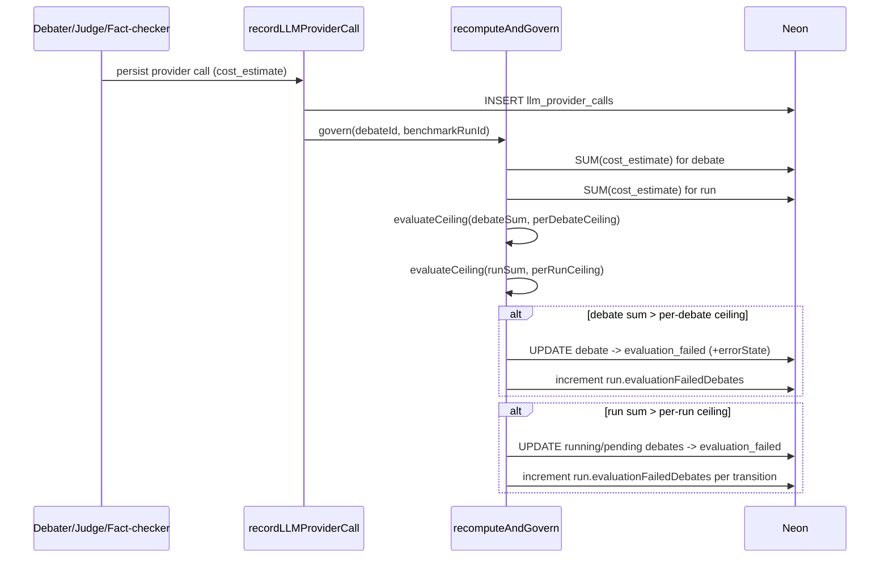

# Design Document

## Overview

The `cost-governor` feature adds real, recorded-cost safety to the benchmarking workbench and removes a gamification data-integrity footgun. It is intentionally a thin layer over data that already exists: every LLM call is already persisted to `llm_provider_calls` with a `cost_estimate` (see `lib/llm/telemetry.ts`), so cost governance is fundamentally an *aggregation + threshold + state-transition* problem, not new accounting infrastructure.

The work splits into three independent tracks that share one spec because they all serve the same Phase-7 cost-safety / data-integrity goal:

1. **Cost governor (highest value).** A small, mostly-pure cost engine that sums `Reported_Cost` per debate and per run, compares the sum against optional per-run-configured ceilings, and trips offending debates to `evaluation_failed`. It also fixes the `lib/middleware/cost-guard.ts` bug where `currentSpend` is hardcoded to `0`, replacing it with a real sum over the current UTC day window.
2. **Schema cleanup.** A Drizzle migration that drops the `userProfiles` table and the three betting columns on `userVotes` (`wagerAmount`, `oddsAtBet`, `payoutAmount`), relocating the dropped structures into an unreachable archive schema, while protecting plain crowd-vote columns from accidental loss.
3. **Documentation correction.** An idempotent edit that prepends a "superseded" notice to the archived "marketplace of truth" paper, pointing readers at `docs/REVIVAL_ROADMAP.md`.

### Design Principles

- **Reuse before build (ponytail).** The cost engine consumes the existing `llm_provider_calls` rows and the existing `debates.errorState` / `benchmarkRuns.evaluationFailedDebates` fields. No new cost tables. The metrics-exclusion behavior already exists in `lib/benchmark/dataset.ts:buildModelMetrics`; we extend it with an opt-in rather than rewrite it.
- **Fail closed on cost safety.** When spend cannot be computed (DB error), the system denies rather than allowing unbounded spend (Req 6.6, 3.4).
- **Pure core, thin shell.** Cost summation, ceiling evaluation, and config validation are pure functions that are trivial to property-test. Database reads/writes and migrations are thin wrappers around that core.
- **Preserve, never destroy artifacts.** Tripping a debate only changes `status`/`errorState`/`completedAt`; turns, provider calls, votes, and tallies are retained (Req 5, Req 8). This mirrors the existing executor's `evaluation_failed` handling.
- **`$0` is valid data, not a defect.** BYOK-routed and Azure deployments legitimately report `0`/`null` cost (see `model-configuration.md`); the engine treats these as a `0` contribution, never an error.

## Architecture

### Component Map

```mermaid
flowchart TD
    subgraph Execution["Benchmark execution (lib/benchmark/runner.ts)"]
        Runner[runBenchmark loop]
    end
    subgraph Engine["Cost engine (lib/cost/*) — pure"]
        Sum[sumReportedCost]
        CeilEval[evaluateCeiling]
        Validate[validateCostCeilings]
    end
    subgraph Persist["Cost governor (lib/cost/governor.ts) — DB shell"]
        Recompute[recomputeAndGovern]
        TripDebate[tripDebate / tripRunDebates]
    end
    subgraph Telemetry["lib/llm/telemetry.ts"]
        Record[recordLLMProviderCall]
    end
    subgraph Guard["lib/middleware/cost-guard.ts"]
        DaySpend[computeCurrentDaySpend]
        Check[checkCostGuard]
    end
    subgraph DB[(Neon / Drizzle)]
        Calls[(llm_provider_calls)]
        Debates[(debates)]
        Runs[(benchmark_runs)]
    end

    Runner -->|before each debate| Recompute
    Record -->|after insert| Recompute
    Recompute --> Sum
    Recompute --> CeilEval
    Recompute -->|sum > ceiling| TripDebate
    TripDebate --> Debates
    TripDebate -->|increment counter| Runs
    Recompute --> Calls
    Runner -->|read ceilings| Validate
    Check --> DaySpend
    DaySpend --> Calls
    Check --> Sum
```

### Control Flow: Per-Call Governance

The governor hooks the point where cost is recorded. After `recordLLMProviderCall` persists a row, the governor recomputes the affected debate's and run's accumulated cost and trips if a ceiling is exceeded.



### Two Enforcement Points

Cost ceilings need both a *reactive* trip (after spend is recorded) and a *preventive* gate (before more spend happens):

- **Reactive trip** happens in `recomputeAndGovern`, invoked right after each provider-call insert. This is where a debate/run actually flips to `evaluation_failed` (Req 1.2, 2.2).
- **Preventive gate** is a status check. Before the runner starts the next debate, and before an agent initiates a provider call, the code checks whether the debate is already `evaluation_failed` or the run is already tripped, and skips the call (Req 1.4, 2.3). Because the existing engine already isolates each debate in the `runBenchmark` loop, the run-level gate is a single guard at the top of the loop body.

### Daily Cost Guard (Bug Fix)

`lib/middleware/cost-guard.ts` currently hardcodes `currentSpend = 0`, so the daily cap never actually trips. The fix replaces that constant with a real query:

- `computeCurrentDaySpend()` sums `cost_estimate` from `llm_provider_calls` where `created_at` falls within `[00:00:00.000, 23:59:59.999]` UTC of the current calendar date, using the same normalization as the cost engine (`0`/`null` → `0`).
- The decision stays the same shape (`currentSpend + estimate <= cap`) but now uses real spend, returns the trio (`currentSpend`, `cap`, `estimatedCost`) in the response body, and **fails closed**: if the sum query throws, the guard denies with an error indication rather than allowing (Req 6.6).

### Schema Cleanup

A new Drizzle migration (`drizzle/0005_*.sql`, generated from the edited `lib/db/schema.ts`):

1. Moves `user_profiles` and the three betting columns into an `archive` Postgres schema (e.g. `archive.user_profiles_legacy`) so they are retained for history but unreachable from the active `public` schema and from Drizzle relations (Req 7.7).
2. Drops `user_profiles` and the betting columns from `public` (Req 7.1, 7.2, 7.4).
3. Runs inside a transaction so any failure rolls back with schema + data intact (Req 7.5).
4. Is written to be idempotent (`IF EXISTS` / `IF NOT EXISTS` guards) so re-application against an already-clean DB is a no-op success (Req 7.6).

The Drizzle schema definition itself is edited to delete `userProfiles`, its relations, and the betting columns, while keeping `vote`, `confidence`, `reasoning`, identity/abuse columns, and the `debates` crowd-tally columns intact (Req 8). A lightweight **schema guard** test asserts the protected column set still exists in `schema.ts` and that no relation references `userProfiles`, catching accidental drops in review (Req 8.4, 7.3).

### Documentation Correction

A small script/helper (`scripts/mark-superseded.ts` or a one-shot edit) that:
- Reads the archived paper, checks for an existing notice sentinel, and if absent prepends a fixed Markdown notice block referencing `docs/REVIVAL_ROADMAP.md`, preserving the original bytes below (Req 9.1–9.3).
- Is idempotent via the sentinel check (Req 9.4) and errors without partial writes if the file is missing/unreadable (Req 9.5).

> Note: the archived "marketplace of truth" paper is referenced in the repo (e.g. `CritiqueTranscript-LLMargument.txt`) but its concrete file path under the archive/docs tree must be confirmed at implementation time. The missing-file path (Req 9.5) is a first-class handled case precisely because the target may not exist yet.

## Components and Interfaces

### `lib/cost/aggregate.ts` (pure)

```typescript
/** A single record's reported cost: number, null, undefined, or an invalid value. */
export type ReportedCost = number | null | undefined

export interface CostSummary {
  /** Arithmetic sum of valid (finite, >= 0) contributions; always finite and >= 0. */
  total: number
  /** Count of records normalized to 0 because their cost was negative or non-numeric. */
  invalidCount: number
}

/** Normalize one record's cost: finite & >= 0 keeps its value; everything else -> 0. */
export function normalizeCost(cost: ReportedCost): number

/** Sum reported costs, treating 0/null/absent/negative/non-numeric as a 0 contribution. */
export function sumReportedCost(costs: ReportedCost[]): CostSummary
```

### `lib/cost/ceiling.ts` (pure)

```typescript
export type CeilingType = 'per_debate' | 'per_run'

export interface CeilingDecision {
  tripped: boolean
  ceilingType: CeilingType
  ceiling: number | null   // null when unconfigured
  accumulated: number
}

/**
 * Trips iff ceiling is configured (non-null) AND accumulated is strictly greater
 * than ceiling. An unconfigured ceiling never trips and never restricts.
 */
export function evaluateCeiling(
  ceilingType: CeilingType,
  accumulated: number,
  ceiling: number | null
): CeilingDecision

export const CEILING_MIN = 0
export const CEILING_MAX = 1_000_000

export interface CeilingValidationError {
  field: 'perDebateCostCeilingUsd' | 'perRunCostCeilingUsd'
  reason: string
}

/** Each present ceiling must be a finite number in [0, 1_000_000]. */
export function validateCostCeilings(config: {
  perDebateCostCeilingUsd?: unknown
  perRunCostCeilingUsd?: unknown
}): { valid: boolean; errors: CeilingValidationError[] }
```

### `lib/cost/error-state.ts` (pure)

```typescript
export interface CostErrorState {
  stage: 'cost-governor'
  ceilingType: CeilingType
  ceiling: number
  accumulated: number
  measuredAt: string // ISO timestamp
}

/** Build the errorState payload written to debates.errorState on a cost trip. */
export function buildCostErrorState(decision: CeilingDecision): CostErrorState
```

### `lib/cost/governor.ts` (DB shell)

```typescript
export interface GovernResult {
  debateTripped: boolean
  runTrippedDebateIds: string[]
}

/**
 * Recompute accumulated debate + run cost from llm_provider_calls and apply
 * ceilings. Trips the debate and/or all running|pending debates of the run.
 * Idempotent: a debate already in evaluation_failed is left unchanged and does
 * not re-increment the run counter.
 */
export async function recomputeAndGovern(
  debateId: string | null,
  benchmarkRunId: string | null
): Promise<GovernResult>

/** Read + validate ceilings from a benchmark run's config jsonb. */
export async function getRunCeilings(benchmarkRunId: string): Promise<{
  perDebateCostCeilingUsd: number | null
  perRunCostCeilingUsd: number | null
}>

/** Preventive gate: true if the debate's run is already cost-tripped. */
export async function isRunCostTripped(benchmarkRunId: string): Promise<boolean>
```

`recordLLMProviderCall` is extended to call `recomputeAndGovern(debateId, benchmarkRunId)` after a successful insert. Governance failures are caught and logged (like the existing telemetry try/catch) so a governance error never corrupts the recorded artifact — but the daily guard, a separate pre-creation gate, still fails closed.

### `lib/benchmark/config.ts` (extended)

The Zod schema gains two optional ceiling fields, validated to `[0, 1_000_000]`:

```typescript
export const benchmarkRunConfigSchema = z.object({
  name: z.string().min(1).default('benchmark-run'),
  description: z.string().optional(),
  perDebateCostCeilingUsd: z.number().finite().min(0).max(1_000_000).optional(),
  perRunCostCeilingUsd: z.number().finite().min(0).max(1_000_000).optional(),
  debates: z.array(benchmarkDebateConfigSchema).min(1),
})
```

`parseBenchmarkRunConfig` already throws a field-identifying error on invalid input; the new fields inherit that behavior (Req 3.3). The runner reads ceilings before launching any debate (Req 3.1) and re-checks `isRunCostTripped` at the top of the loop body (Req 2.3).

### `lib/middleware/cost-guard.ts` (fixed)

```typescript
/** Sum cost_estimate for the current UTC calendar day; normalizes 0/null -> 0. */
export async function computeCurrentDaySpend(now?: Date): Promise<number>

export async function checkCostGuard(config: DebateConfig): Promise<{
  allowed: boolean
  reason?: string
  currentSpend: number
  cap: number
  estimatedCost: number
  error?: boolean   // true when spend could not be computed (fail-closed)
}>
```

### `lib/benchmark/dataset.ts:buildModelMetrics` (extended)

Add an options arg `{ includeEvaluationFailed?: boolean }`. Default (`false`) keeps the current exclusion behavior; when `true`, evaluation-failed debates participate in win/loss/tie aggregation (Req 5.4, 5.5). The aggregate-research-metrics endpoints (`app/api/monitoring/metrics`, `app/api/admin/metrics`) read the opt-in from a query param.

## Data Models

No new tables. The feature uses existing fields and adds two optional config keys.

### `benchmarkRuns.config` (jsonb) — extended shape

```typescript
{
  name: string
  description?: string
  perDebateCostCeilingUsd?: number  // [0, 1_000_000], optional
  perRunCostCeilingUsd?: number     // [0, 1_000_000], optional
  debates: BenchmarkDebateConfig[]
}
```

### `debates.errorState` (jsonb) — cost-trip payload

```typescript
{
  stage: 'cost-governor'
  ceilingType: 'per_debate' | 'per_run'
  ceiling: number       // configured ceiling that was exceeded
  accumulated: number   // measured accumulated cost at trip time
  measuredAt: string    // ISO 8601
}
```

This coexists with the existing judge-failure errorState shape (`{ stage: 'judge' | 'execution', ... }`); `stage` discriminates them.

### Existing fields consumed (unchanged schema)

- `llm_provider_calls.cost_estimate` (`real`, nullable) — the `Reported_Cost` source.
- `llm_provider_calls.created_at` — day-window filter for the daily guard.
- `llm_provider_calls.debate_id` / `benchmark_run_id` — aggregation grouping keys.
- `debates.status` — gains no new value; reuses existing `'evaluation_failed'`.
- `benchmarkRuns.evaluationFailedDebates` — incremented once per debate's first transition into `evaluation_failed`.

### Schema removals (Req 7, Req 8)

- **Removed from active schema:** `userProfiles` table (and `userProfilesRelations`); `userVotes.wagerAmount`, `userVotes.oddsAtBet`, `userVotes.payoutAmount`; the `userVotes -> userProfiles` relation.
- **Relocated:** the removed structures move to an `archive` schema, unreachable from active Drizzle definitions.
- **Protected (must remain, identical type + data):** `userVotes.{vote, confidence, reasoning, debateId, userId, sessionId, ipAddress, wasCorrect, createdAt}` and `debates.{crowdVotesProCount, crowdVotesConCount, crowdVotesTieCount, crowdWinner}`.

> Out-of-scope cleanup the migration enables (tracked, not part of this schema change): `lib/middleware/validation.ts` has a `wagerAmount` field in its vote schema and `app/api/monitoring/metrics/route.ts` reads `wager_amount`; both reference removed columns and must be updated in the implementation tasks so the build stays green.
