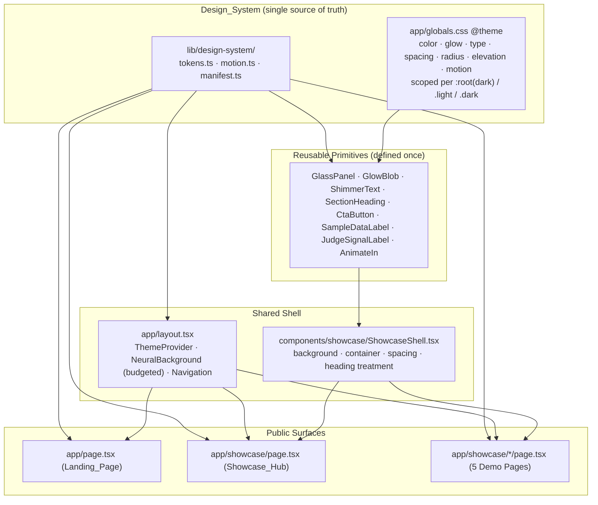

# Design Document: Showcase Redesign

## Overview

This feature rebuilds the public-facing surface of the LLMargument workbench — the Landing_Page (`app/page.tsx`), the Showcase_Hub (`app/showcase/page.tsx`), and the five Showcase_Demo_Pages (`live-debate`, `eval-report`, `regression-gate`, `steelman`, `synthetic-data`) — into one cohesive, restrained, pitch-deck-grade presentation layer.

The existing surfaces are approved for teardown. The current implementation hard-codes a five-color palette (cyan / violet / pink / amber / emerald) inline across every page, redefines glass/glow utilities per file, sets conflicting page backgrounds on demo pages (each demo wraps itself in `bg-gradient-to-br from-slate-900...`), and runs unbudgeted decorative animation (a global `NeuralBackground` canvas plus per-page `glow-blob` floats and `shimmer-text` shine, none of which respect `prefers-reduced-motion`). The redesign replaces this with:

1. A **centralized Design_System** as the single source of truth for all visual tokens (color, glow, typography scale, spacing scale, corner radius, elevation, motion), expressed as Tailwind v4 `@theme` custom properties scoped per Theme_Mode, plus a thin typed TypeScript layer (`lib/design-system/`) that exposes token *names*, design-time allow-lists, a total token resolver, and a reduced-motion-aware motion-variant builder.
2. A **shared page shell** (`components/showcase/ShowcaseShell.tsx`) that renders one consistent background, container width, spacing rhythm, and heading treatment for the hub and all demo pages, so no demo page declares its own background.
3. A **disciplined Neon_3D_Aesthetic** — one primary accent plus at most three supporting accents, glow restricted to accent/emphasis roles, brand logo and infographic as persistent visual anchors, and a hard per-viewport budget of at most three concurrent Decorative_Animations, all gated behind reduced-motion.
4. **Honest research-workbench framing** — judge output labeled as a model-based signal, sample data labeled as such, all CTAs routed to real existing routes, and a Navigation_Shell that exposes only the six approved research destinations with zero reachability to gamification / prediction-market / social content.

This is a presentation-only change. It introduces no new product features, no new data persistence, no new auth, and no gamification, consistent with `AGENTS.md` non-goals and the project roadmap.

### Goals

- Single source of truth for visual styling; zero per-page palette or primitive redefinition.
- Cohesive shell across hub and demo pages; no conflicting backgrounds.
- Subtle, credible neon-3D aesthetic that never sacrifices contrast or readability.
- Every CTA reaches a real route; honest framing preserved throughout.
- Responsive (375 / 768 / 1440), accessible (contrast, keyboard, single h1, no focus traps, reduced-motion), theme-consistent (light/dark), and performant (hero budget, optimized images, zero CLS from decoration).

### Non-Goals

- No changes to debate execution, persistence, judging, fact-checking, or export logic.
- No new routes beyond the minimal system-health page required to satisfy the navigation contract.
- No prediction-market, betting, DebatePoints, superforecaster, social-sharing, or virality features or routes.

## Architecture

### Layering



### Design_System expression in this stack

The project uses **Tailwind CSS v4** (CSS-first configuration via `@import "tailwindcss"`; there is no `tailwind.config.js` in the active app). The Design_System is therefore expressed as:

- **Canonical token values live in exactly one place: `app/globals.css`.** A single `@theme` block declares every token category as a CSS custom property (e.g. `--color-accent-primary`, `--glow-accent`, `--radius-card`, `--shadow-elevation-2`, `--space-section`, `--text-hero`, `--duration-entrance`, `--ease-standard`). Theme-dependent values (surface, text, accent, border) are overridden in scoped blocks: `:root` (dark default), `.light`, and an explicit `.dark` block (added to remove the current `:root`-only ambiguity so the class the ThemeProvider sets always maps to rules).
- **The typed layer (`lib/design-system/`) references token names, never re-declares values**, so no category is defined in more than one location (Requirement 1.1). It provides:
  - `tokens.ts` — `const` string unions of token *names* and the accent allow-list (one primary + ≤3 supporting), consumed by components and property tests.
  - `motion.ts` — a pure, reduced-motion-aware variant builder for Framer Motion. Durations are read from the CSS custom properties (single source) via a small `getMotionToken()` helper, so JS and CSS share one definition.
  - `manifest.ts` — typed registries (navigation destinations, showcase demo entries, CTA targets, brand images) used both to render and to property-test invariants.
- **Reusable primitives are defined exactly once** as components/utility classes (`glass-panel`, `glow-blob`, `shimmer-text` consolidated into `app/globals.css` and wrapped by `GlassPanel` / `GlowBlob` / `ShimmerText` components). Every surface references these rather than re-declaring blurred/bordered/gradient styles inline.

This satisfies Requirement 1 (centralized system, single-location categories, ≤4 accents, primitives defined once) and Requirement 10 (theme-scoped tokens, no hard-coded colors outside scoped tokens).

### Shared shell architecture

- `app/layout.tsx` keeps `ThemeProvider`, `Navigation`, and `NeuralBackground` as the global frame. `NeuralBackground` is modified to (a) respect `prefers-reduced-motion` (pause/stop the canvas loop) and (b) count as the single global Decorative_Animation, leaving headroom of two more per viewport.
- `ShowcaseShell` is a server-friendly wrapper applying the shared background treatment, max-width container, horizontal padding, vertical section rhythm (from the spacing scale), and the standard heading treatment. The Showcase_Hub and all five Demo Pages render their content inside `ShowcaseShell` and **do not set their own background** (Requirement 4.3, 4.4). The Landing_Page uses the same tokens and primitives; its hero is bespoke but draws background and spacing from the shell tokens.
- Each Demo Page renders a `<BackToHub />` return link targeting `/showcase` (Requirement 4.2).

### Navigation and route contract

The `Navigation` component is rebuilt to expose **only** the six approved research destinations (Requirement 6.4), each mapped to a real, resolvable route (Requirement 5.2, 5.3). No gamification/prediction/social destination is present or reachable (Requirement 6.2, 6.3, 6.5).

| Nav destination (Req 6.4)                  | Route                     | Status            |
|--------------------------------------------|---------------------------|-------------------|
| Create benchmark run                       | `/debate/new`             | exists            |
| Inspect debate transcript                  | `/debate/example`         | exists            |
| Review fact-checks and judge output        | `/showcase/live-debate`   | exists            |
| Compare models within a benchmark run      | `/showcase/eval-report`   | exists            |
| Export datasets                            | `/showcase/synthetic-data`| exists            |
| System health                              | `/health` (new minimal page) | **to add**     |

`/api/health` returns JSON only. To honor "no dead links" and the navigation contract without a placeholder, the design adds one minimal page `app/health/page.tsx` that fetches `/api/health` and renders status. This is the only new route. All CTAs (landing primary/secondary, hub demo cards, demo-page links) resolve to routes in this set or to `/showcase/*` demos; none is an anchor-only `#`, disabled, or non-routable target (Requirement 5.3).

### Reduced-motion and animation-budget strategy

- A single hook, `useReducedMotion()` (re-exported from Framer Motion), is the gate. Components ask the `motion.ts` variant builder for variants; when reduced motion is active the builder returns opacity-only transitions capped at 200 ms and disables positional/scale/rotation motion (Requirement 9.1, 9.7).
- CSS decorative effects (`glow-blob` float, `shimmer-text` shine) are disabled under `@media (prefers-reduced-motion: reduce)`; brand logo and infographic anchors remain visible (Requirement 2.7).
- **Per-viewport budget of ≤3 concurrent Decorative_Animations** is enforced by convention and documented per surface: the global `NeuralBackground` (1) + at most two page-local decorative animations. Entrance animations are one-shot (not "running" decoration) and capped at 600 ms (Requirement 9.6).
- Auto-advancing simulated sequences (e.g. the live-debate-style simulator) expose a persistent pause/resume control, stop within 100 ms of pause, show a paused indicator, and under reduced motion start paused and require explicit advance (Requirement 9.3, 9.4, 9.5, 9.7).

## Components and Interfaces

### Design_System modules (`lib/design-system/`)

```ts
// tokens.ts — names only; values live in app/globals.css @theme (single source)
export const ACCENT_TOKENS = {
  primary: 'accent-primary',
  supporting: ['accent-2', 'accent-3', 'accent-4'], // at most three (Req 1.5)
} as const
export type AccentToken =
  | typeof ACCENT_TOKENS.primary
  | typeof ACCENT_TOKENS.supporting[number]

export const TOKEN_CATEGORIES = [
  'color', 'glow', 'typography', 'spacing', 'radius', 'elevation', 'motion',
] as const

export type ThemeMode = 'light' | 'dark'

// Total resolver: never returns empty/undefined; falls back to the default
// (dark) theme value when a token is unresolved for the active theme (Req 10.4).
export function resolveToken(name: string, theme: ThemeMode): string
```

```ts
// motion.ts — reduced-motion-aware variant builder (pure, testable)
export interface MotionSpec {
  opacity?: [number, number]
  y?: [number, number]
  scale?: [number, number]
  durationMs: number
}
export type VariantKind = 'entrance' | 'emphasis' | 'hover'

// Pure function. When reducedMotion is true: only opacity changes, durationMs <= 200.
// Always: durationMs <= 600 for entrance variants (Req 9.1, 9.6, 9.7).
export function buildVariant(kind: VariantKind, reducedMotion: boolean): MotionSpec
```

```ts
// manifest.ts — typed registries used to render AND to property-test
export const ALLOWED_NAV_DESTINATIONS = [
  'create-benchmark-run', 'inspect-transcript', 'review-fact-checks-judge',
  'compare-models', 'export-datasets', 'system-health',
] as const

export interface NavItem { id: typeof ALLOWED_NAV_DESTINATIONS[number]; label: string; href: string }
export interface CtaTarget { id: string; label: string; href: string }   // href must be a real route
export interface ShowcaseEntry { href: string; title: string; description: string } // title 1..80, desc 1..200
export interface BrandImage { src: string; alt: string; decorative: boolean }       // alt 1..250 when informational

export const NAV_ITEMS: NavItem[]
export const CTA_TARGETS: CtaTarget[]
export const SHOWCASE_ENTRIES: ShowcaseEntry[]
export const BRAND_IMAGES: BrandImage[]
export const EXISTING_ROUTES: ReadonlySet<string>   // allow-list of real app routes
export const EXCLUDED_PATTERNS: RegExp[]             // prediction|betting|points|badge|wager|share|follow|leaderboard...
```

### Shared shell and primitives (`components/showcase/`, `components/layout/`)

- `ShowcaseShell({ title, intro, children })` — background + container + spacing + `<h1>` heading treatment (exactly one h1 per page, Requirement 8.5). Used by hub and all demo pages.
- `BackToHub()` — return link to `/showcase` (Requirement 4.2), 44×44 minimum target (Requirement 7.6).
- `SectionHeading({ level, children })` — enforces hierarchical heading levels (Requirement 8.5).
- `CtaButton({ variant: 'primary' | 'secondary', href, children })` — primary defined exactly once per page; secondary never reuses primary fill/size/weight (Requirement 3.3, 3.4). Renders as a real `next/link`.
- `GlassPanel`, `GlowBlob`, `ShimmerText` — wrap the single consolidated primitive definitions (Requirement 1.7); glow confined to accent/emphasis (Requirement 2.5).
- `BrandLogo()` — persistent logo anchor via `next/image` (Requirement 2.2, 11.2).
- `Infographic()` — `next/image` with descriptive alt, intrinsic sizing, container-scoped overflow, and a text fallback on fetch error (Requirement 2.3, 7.7, 8.1, 11.2, 11.5).
- `SampleDataLabel()` — visible "Sample / demo data" label co-located with illustrative data sections (Requirement 5.4).
- `JudgeSignalLabel()` — visible "model-based signal, not ground truth" label adjacent to any judge output (Requirement 6.1).
- `AnimateIn({ kind })` — wraps Framer Motion, sourcing variants from `buildVariant` and `useReducedMotion`; entrance ≤600 ms (Requirement 9.6).
- `SimulatorControls({ playing, onToggle })` — persistent pause/resume with paused indicator for any auto-advancing sequence (Requirement 9.3–9.5, 9.7).

### Landing_Page composition (`app/page.tsx`)

Hero + at least four fixed-order sections, each with exactly one section heading (Requirement 3.2), spacing only from the scale (Requirement 3.5):

1. **Hero** — value-prop headline + supporting description + single primary CTA (`/debate/new`) + one secondary CTA (`/showcase`), all visible without scrolling at 1280×720 (Requirement 3.1, 3.3, 3.4); hero renders within budget (Requirement 11.1).
2. **How it works** — infographic anchor + concise data-flow explanation (Requirement 2.3).
3. **What it measures** — benchmark capability cards (double-pass judging, factuality, divergence, structured export), framed as workbench, no gamification language (Requirement 3.6).
4. **Sample artifact** — a compact judge-output preview carrying `SampleDataLabel` + `JudgeSignalLabel` (Requirement 5.4, 6.1).
5. **Call to action** — primary-route reinforcement.

### Showcase_Hub composition (`app/showcase/page.tsx`)

Rendered through `ShowcaseShell`. Maps `SHOWCASE_ENTRIES` to navigable cards (title 1–80, description 1–200; Requirement 4.1), each a real `next/link` (Requirement 4.5, 5.2). On navigation failure the hub stays put and surfaces an error (Requirement 4.7) via an error boundary / try-catch on prefetch.

### Demo pages (`app/showcase/*/page.tsx`)

Each: rendered through `ShowcaseShell` (no own background, Requirement 4.3/4.4), `BackToHub` link, tokens/primitives only, judge output labeled (6.1), sample data labeled (5.4), simulators gated and pausable (9.x).

## Data Models

These are presentation-config types (no database changes). They live in `lib/design-system/manifest.ts` and `tokens.ts` and are the substrate for the property tests.

```ts
type ThemeMode = 'light' | 'dark'

interface DesignToken { name: string; category: typeof TOKEN_CATEGORIES[number] }

interface NavItem { id: AllowedNavDestination; label: string; href: string }

interface CtaTarget { id: string; label: string; href: string }

interface ShowcaseEntry {
  href: string          // must be in EXISTING_ROUTES
  title: string         // 1..80 chars
  description: string   // 1..200 chars
}

interface BrandImage {
  src: string
  alt: string           // informational: 1..250 chars; decorative: '' (empty)
  decorative: boolean
}

interface MotionSpec {
  opacity?: [number, number]
  y?: [number, number]
  scale?: [number, number]
  durationMs: number    // <=600 entrance; <=200 under reduced motion (opacity only)
}
```

Token category coverage (Requirement 1.1) — every category resolves to at least one named token, defined once in `@theme`:

| Category   | Example tokens (names)                                  | Home              |
|------------|---------------------------------------------------------|-------------------|
| color      | `--color-bg`, `--color-surface`, `--color-text`, `--color-accent-primary`, `--color-accent-2..4` | `globals.css @theme` + theme scopes |
| glow       | `--glow-accent`, `--glow-soft`                          | `globals.css @theme` |
| typography | `--text-hero`, `--text-h2`, `--text-body`, `--text-caption` | `globals.css @theme` |
| spacing    | `--space-xs..xl`, `--space-section`                     | `globals.css @theme` |
| radius     | `--radius-card`, `--radius-pill`                        | `globals.css @theme` |
| elevation  | `--shadow-elevation-1..3`                               | `globals.css @theme` |
| motion     | `--duration-entrance`, `--duration-opacity`, `--ease-standard` | `globals.css @theme` |

## Correctness Properties

*A property is a characteristic or behavior that should hold true across all valid executions of a system — essentially, a formal statement about what the system should do. Properties serve as the bridge between human-readable specifications and machine-verifiable correctness guarantees.*

Note that property-based testing applies to this feature's **configuration and logic layer** — the typed Design_System manifests (`tokens.ts`, `manifest.ts`) and pure functions (`resolveToken`, `buildVariant`, the WCAG contrast computation). It does **not** apply to the rendered-layout, viewport, navigation-timing, and performance criteria, which are verified with example/integration/snapshot/Lighthouse tests as noted in the Testing Strategy. The prework classified the full set; the properties below are the deduplicated, non-redundant invariants over the testable logic layer.

### Property 1: Token resolution is total with theme fallback

*For all* declared token names and *for all* Theme_Modes (`light`, `dark`), `resolveToken(name, theme)` returns a non-empty value; when a token has no value scoped to the active theme, the resolver returns the default (dark) theme value rather than empty, undefined, or transparent.

**Validates: Requirements 10.2, 10.4**

### Property 2: Theme-aware contrast meets WCAG thresholds

*For all* `(Theme_Mode, text-role, surface)` color-token pairings used by the Design_System, the computed WCAG 2.1 contrast ratio is at least 4.5:1 for body text and at least 3:1 for large text and meaningful non-text UI (including the focus-indicator ring against its background).

**Validates: Requirements 2.6, 8.3, 8.4, 10.1**

### Property 3: Showcase hub entries are well-formed and navigable

*For all* entries in the showcase registry, the title length is between 1 and 80 characters inclusive, the description length is between 1 and 200 characters inclusive, and the `href` resolves to a route in the set of existing application routes.

**Validates: Requirements 4.1**

### Property 4: Every CTA and navigation target is a real, non-placeholder route

*For all* call-to-action targets and navigation items in the manifest, the `href` is non-empty, is not an anchor-only `"#"` link, is not a disabled/non-routable placeholder, and is a member of the set of existing application routes.

**Validates: Requirements 5.1, 5.2, 5.3**

### Property 5: Navigation integrity — allow-list and non-goal exclusion

*For all* destinations exposed by the Navigation_Shell, the destination identifier is a member of the six approved research destinations; and *for all* navigation items and CTA targets exposed anywhere in the Showcase_Experience, the destination matches none of the excluded patterns (prediction-market, betting, points/DebatePoints, badge/superforecaster, wagering, social-share, follow, virality).

**Validates: Requirements 6.2, 6.3, 6.4**

### Property 6: Image alt-text obeys informational and decorative bounds

*For all* brand/content images in the image registry, an informational image (`decorative === false`) has alt text whose length is between 1 and 250 characters inclusive, and a decorative image (`decorative === true`) has an empty alt text (`""`).

**Validates: Requirements 8.1, 8.2**

### Property 7: Motion variants respect motion discipline

*For all* variant kinds and *for all* reduced-motion states, `buildVariant(kind, reducedMotion)` produces a spec whose entrance duration is at most 600 ms; and whenever `reducedMotion` is true, the spec animates opacity only (no positional, scale, or rotation change) with a duration of at most 200 ms.

**Validates: Requirements 2.7, 9.1, 9.6, 9.7**

## Error Handling

| Condition | Handling | Requirement |
|-----------|----------|-------------|
| Token unresolved for active theme | `resolveToken` falls back to the default (dark) theme value; no surface is left unstyled or transparent | 10.4 |
| Demo navigation fails from the hub | Stay on the Showcase_Hub; surface a visible "couldn't open that demo" error (error boundary + caught prefetch/route error) | 4.7 |
| CTA destination cannot resolve or load | Keep the Visitor on the current page; show a visible error indication rather than a blank/broken view | 5.5 |
| Excluded route requested directly | Do not render excluded content; redirect to an exposed approved destination (handled in `middleware.ts` against `EXCLUDED_PATTERNS`) | 6.5 |
| Image fetch fails | Render the image's text alternative in place; never show a broken-image state (`next/image` `onError` → text fallback) | 11.5 |
| Hero/showcase content not loaded within 1s | Render placeholder content (skeletons) for pending sections; progressively replace via React Suspense / loading boundaries | 11.4 |
| Theme token map missing a category at build | Build-time assertion (Property 1 test) fails CI before ship | 1.1, 10.4 |

Trust-boundary note: the Design_System manifests are first-party data, but the property tests treat them as untrusted input (generating malformed entries) so a future bad edit — an empty title, a `"#"` href, an excluded route, a missing alt — fails CI rather than shipping.

## Testing Strategy

### Dual approach

- **Property tests** (logic/config layer) — universal invariants over the Design_System manifests and pure functions, using **`fast-check`** (already a dev dependency). Run via the existing `npm run test:unit` (`tsx tests/run-unit-tests.ts`) harness.
- **Example / integration / snapshot tests** — for rendered structure, viewport layout, navigation timing, theming behavior, and performance, which are not amenable to PBT (UI rendering and browser behavior). The repo already has **Playwright** for browser-level checks.

### Property test configuration

- Each of the seven correctness properties is implemented as a **single** property-based test running **at least 100 iterations**.
- Generators produce both the real manifest entries and randomized valid/invalid variants (e.g. random titles up to and beyond 80 chars, random hrefs including `"#"` and excluded patterns, random token names including ones absent from a theme scope, random `(kind, reducedMotion)` pairs).
- Each test is tagged with a comment referencing its design property:
  - `// Feature: showcase-redesign, Property 1: Token resolution is total with theme fallback`
  - …through Property 7.

### Example / integration coverage (non-PBT criteria)

- **Structure (examples):** ≥4 ordered landing sections each with one heading (3.2); exactly one primary CTA (3.3); secondary CTAs visually distinct (3.4); one `<h1>` per page with no skipped heading levels (8.5); logo persistent (2.2) and infographic present (2.3); `BackToHub` on every demo (4.2); `SampleDataLabel` co-located with sample data (5.4); `JudgeSignalLabel` adjacent to judge output (6.1); shared `ShowcaseShell` composition (4.3); pause control present, stops <100 ms, resumes, starts paused under reduced motion (9.3–9.5, 9.7); landing copy uses workbench framing and no excluded terms (3.6); image-error text fallback (11.5); failed-navigation error states (4.7, 5.5); excluded-route redirect (6.5).
- **Responsive (Playwright at 375 / 768 / 1440):** no horizontal scroll / overflow (7.1–7.3); CTA stacking at 375 (7.4); no overlap/clipping (7.5); 44×44 targets (7.6); oversized-content containment (7.7); hero above the fold at 1280×720 (3.1).
- **Theme (Playwright):** theme toggle restyles all surfaces within 300 ms with none left in the previous theme (10.3).
- **Performance (Lighthouse / trace):** hero render ≤2.5 s (11.1); image optimization and display-ratio (11.2); CLS 0 during decorative animation (11.3); progressive placeholders (11.4).
- **Static / smoke checks:** no raw hex/px/ms outside the Design_System (1.2–1.4, 3.5); accent usages reference accent tokens only (1.6); primitives declared exactly once (1.7); no glow on body text (2.5); demo roots declare no background (4.4); glow/gradient area ≤40% of viewport (2.1, measured at the three breakpoints).
- **Accessibility (Playwright + axe):** keyboard activation and visible focus (8.4); reading-order focus (8.6); no focus trap (8.7); reduced-motion suppression with anchors visible (2.7, 9.2).

### Verification commands

```bash
npm run typecheck
npm run lint
npm run test:unit          # includes the 7 fast-check property tests
npm run build
# Playwright (responsive/theme/a11y) and Lighthouse (performance) for rendered criteria
```

## Requirements Traceability

| Requirement | Addressed by | Verified by |
|-------------|--------------|-------------|
| 1.1 Seven token categories, single source | `globals.css @theme` + `TOKEN_CATEGORIES` | Example + Property 1 |
| 1.2–1.4 Token-only styling on all surfaces | Tokens + primitives; no inline literals | Static/smoke scan |
| 1.5 ≤1 primary + ≤3 supporting accents | `ACCENT_TOKENS` | Example |
| 1.6 Applied accents ∈ tokens | accent token usage | Static scan |
| 1.7 Primitives defined once | consolidated `glass-panel`/`glow-blob`/`shimmer-text` | Static scan |
| 2.1 Glow/gradient ≤40% viewport | budgeted decorative layout | Measured at 375/768/1440 |
| 2.2 Logo persistent | `BrandLogo` in shell/nav | Example |
| 2.3 Infographic anchor | `Infographic` on landing | Example |
| 2.4 ≤3 concurrent decorative anims | budget: NeuralBackground + ≤2 local | Example per surface |
| 2.5 Glow on accent/emphasis only | primitive scoping | Static scan |
| 2.6 Contrast fallback ≥4.5:1 | theme token pairs | Property 2 |
| 2.7 Reduced motion suppresses decoration | `buildVariant` + CSS media query | Property 7 + a11y example |
| 3.1 Hero above the fold @1280×720 | hero layout | Integration |
| 3.2 ≥4 ordered sections, one heading each | landing composition | Example |
| 3.3 Exactly one primary CTA | `CtaButton` primary | Example |
| 3.4 Secondary CTAs distinct | `CtaButton` secondary variant | Example |
| 3.5 Spacing scale between sections | spacing tokens | Static scan |
| 3.6 Workbench framing, no gamification copy | landing copy + `EXCLUDED_PATTERNS` | Example |
| 4.1 Hub entries navigable, title/desc bounds | `SHOWCASE_ENTRIES` | Property 3 |
| 4.2 Return link on demos | `BackToHub` | Example |
| 4.3 Shared shell tokens | `ShowcaseShell` | Example |
| 4.4 No conflicting demo background | shell-only background | Static scan |
| 4.5 Demo nav ≤1s | `next/link` prefetch | Integration |
| 4.6 Return nav ≤1s | `next/link` | Integration |
| 4.7 Demo nav failure stays on hub + error | error boundary | Example |
| 5.1–5.3 CTAs route to real routes | `CTA_TARGETS`/`NAV_ITEMS` + `EXISTING_ROUTES` | Property 4 (+ timing integration) |
| 5.4 Sample-data label in-section | `SampleDataLabel` | Example |
| 5.5 CTA failure keeps page + error | error handling | Example |
| 6.1 Judge-output signal label | `JudgeSignalLabel` | Example |
| 6.2–6.4 Exclusions + nav allow-list | `manifest.ts` allow/exclude | Property 5 |
| 6.5 Excluded route redirect | `middleware.ts` | Example |
| 7.1–7.7 Responsive layout | shell + responsive tokens | Integration (Playwright) |
| 8.1–8.2 Image alt-text bounds | `BRAND_IMAGES` | Property 6 |
| 8.3 Contrast | theme token pairs | Property 2 |
| 8.4 Keyboard + focus indicator | focusable controls + focus ring token | Property 2 (ring contrast) + a11y integration |
| 8.5 One h1, hierarchical headings | `ShowcaseShell`/`SectionHeading` | Example |
| 8.6–8.7 Focus order, no trap | semantic DOM order | a11y integration |
| 9.1 Reduced motion opacity-only ≤200ms | `buildVariant` | Property 7 |
| 9.2 Text/controls readable regardless of anim | layering | Example |
| 9.3–9.5 Pause/resume controls | `SimulatorControls` | Example |
| 9.6 Entrance ≤600ms | `buildVariant`/`AnimateIn` | Property 7 |
| 9.7 Reduced motion stops auto-advance | `SimulatorControls` + `buildVariant` | Property 7 + example |
| 10.1 Theme contrast | theme token pairs | Property 2 |
| 10.2 Theme-scoped tokens, no hard-coded | `@theme` scopes + `resolveToken` | Property 1 + static scan |
| 10.3 Theme switch ≤300ms, no stale surface | CSS custom-property theming | Integration |
| 10.4 Token fallback to default theme | `resolveToken` | Property 1 |
| 11.1 Hero ≤2.5s | hero budget | Lighthouse |
| 11.2 Optimized images, display ratio | `next/image` | Smoke/Lighthouse |
| 11.3 CLS 0 during animation | reserved space, transform-only decor | Trace |
| 11.4 Placeholders within 1s | Suspense/loading boundaries | Example/Integration |
| 11.5 Image-fetch fallback | `next/image` `onError` text fallback | Example |
